# 📖 Furqan – Quran App

**Furqan** is a comprehensive and beautifully designed Quran reading and listening app built with **Flutter**.  
It provides a complete Islamic experience with features that help users read, listen, understand, and track their Quran activities efficiently.

---

## 🚀 Features

### 🕋 Quran Reading & Listening
- Read the **entire Quran** with a clean and elegant UI.
- Listen to **multiple reciters** with high-quality audio playback.
- Bookmark verses or surahs to continue reading later.
- Adjust font size and reading mode for better readability (light/dark themes).

### 🔍 Surah & Verse Search
- Search for surahs or specific verses instantly.
- Quick navigation to any surah or ayah.

### 🎧 Audio Player
- Integrated audio player with **play, pause, repeat, and next/previous controls**.
- Background playback supported for seamless Quran listening.
- Displays **current reciter name, surah, and verse** while playing.

### 📊 User Statistics
- Tracks user reading and listening progress.
- Stores user activity (read surahs, listening duration, etc.) securely using **Supabase**.

### 📚 Tafsir (Interpretation)
- Read tafsir for any verse directly within the app.
- Supports multiple tafsir sources for deeper understanding.

### 🙏 Azkar & Dua
- A rich collection of **daily adhkar** and **duas** from authentic sources.
- Categorized into morning, evening, and general supplications.

### 🕰 Prayer Times
- Automatically detects the user's location and shows **accurate prayer times**.
- Supports multiple calculation methods and notification reminders.

### 🔢 Tasbeeh Counter
- Digital **tasbeeh counter** to keep track of dhikr.
- Saves history and daily tasbeeh progress locally.

### ☁️ Cloud Integration
- Integrated with **Supabase** for user authentication and data storage.
- Syncs bookmarks, reading progress, and stats across devices.

### 🗄 Local Caching
- Uses **Hive** for fast and efficient local data storage.
- Enables offline reading, tafsir access, and audio caching.

---

## 🧠 Tech Stack

- **Framework:** Flutter (Dart)
- **Backend:** Supabase
- **Database:** Hive (local) + Supabase (cloud)
- **State Management:** Provider / Riverpod
- **Packages Used:**
  - `http`, `dio`, `shared_preferences`, `hive`
  - `flutter_local_notifications`, `cached_network_image`
  - `intl`, `audio_players`, `path_provider`, `url_launcher`
  - `google_fonts`, `lottie`, `webview_flutter`
  - `location`

---

## 🎯 Goals
Furqan aims to provide a **complete Islamic companion app**, combining Quran reading, listening, tafsir, azkar, and prayer tools in one place — with a smooth and modern user experience.

---
## 📸 App Screenshots

| | | |
|---|---|---|
| 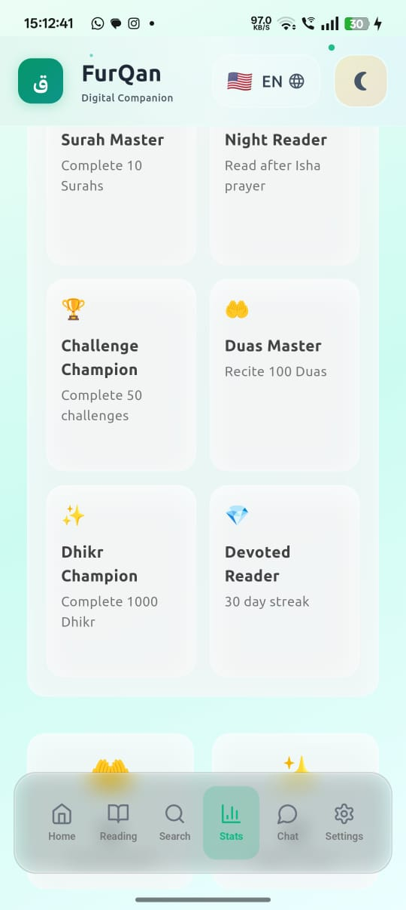 | 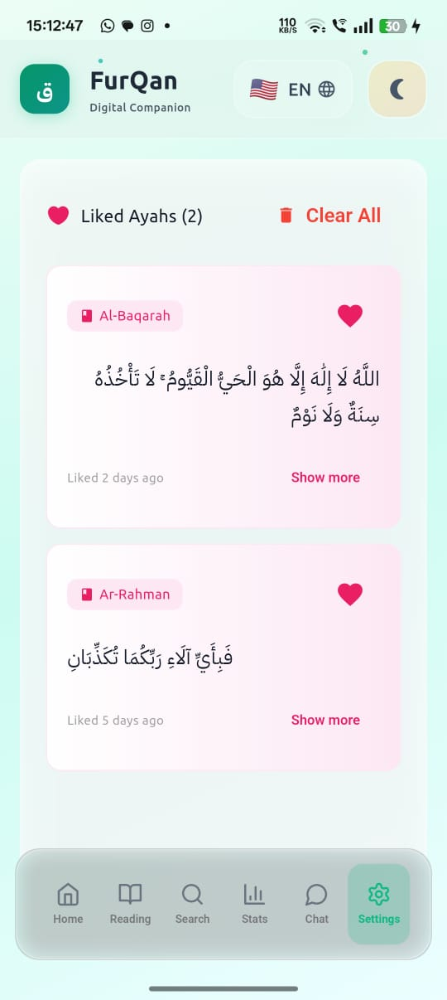 | 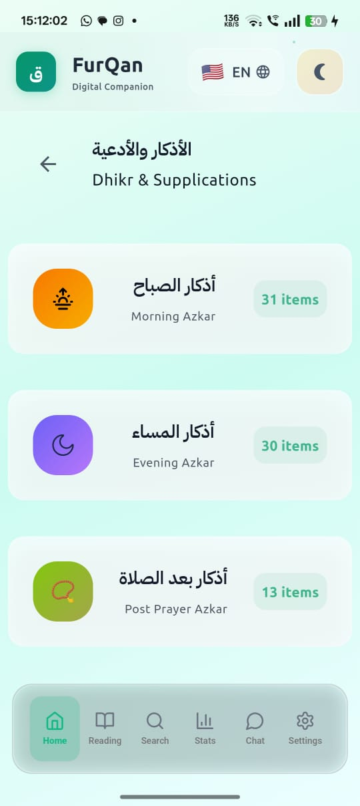 |
| **achievements** | **ayahs** | **azkar** |
| 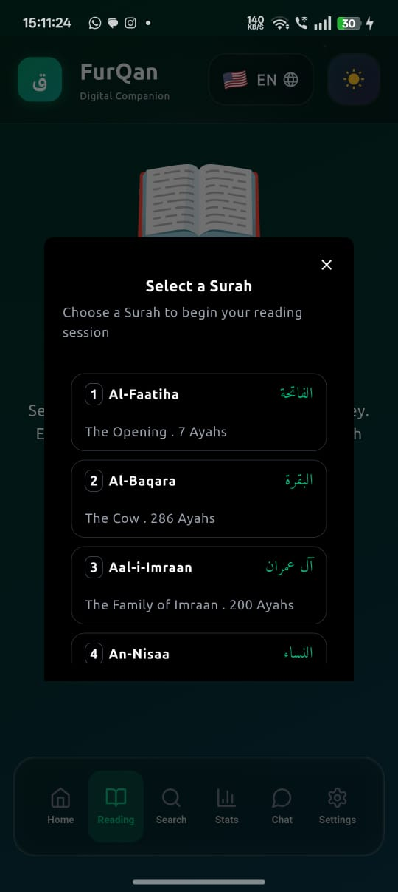 | 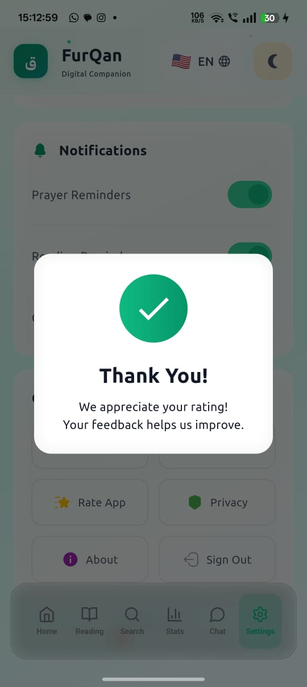 | 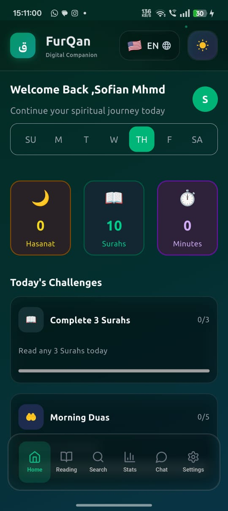 |
| **chosse_surah** | **complaint_successful** | **home** |
| 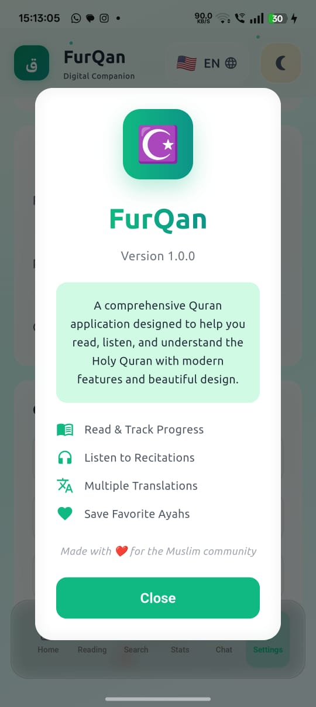 | 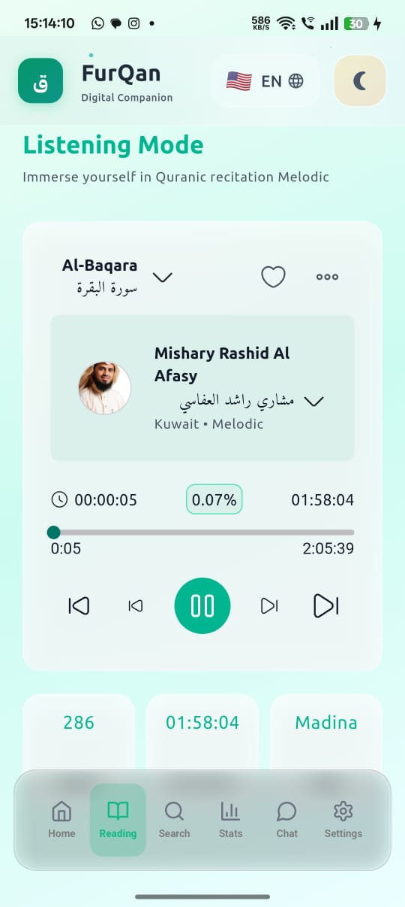 | 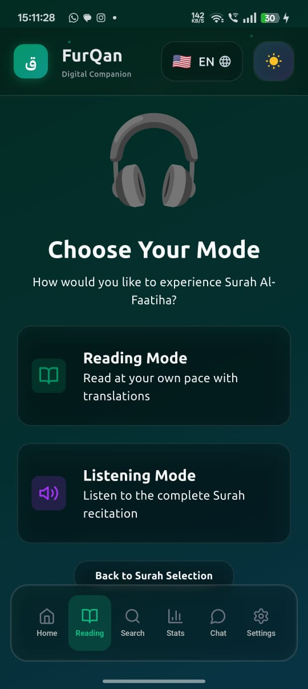 |
| **info_app** | **listen_mode** | **listen** |
| 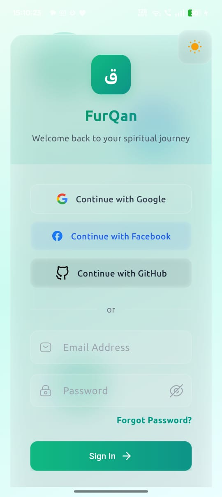 | 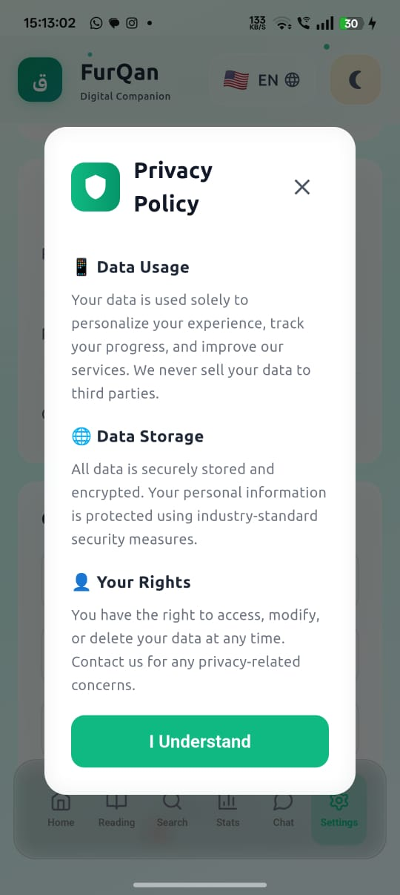 |  |
| **login** | **privacy** | **rate** |
| 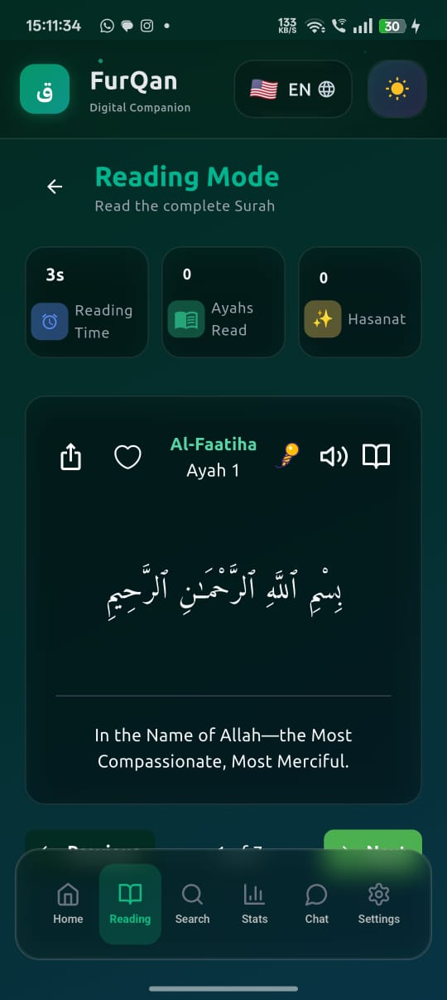 | 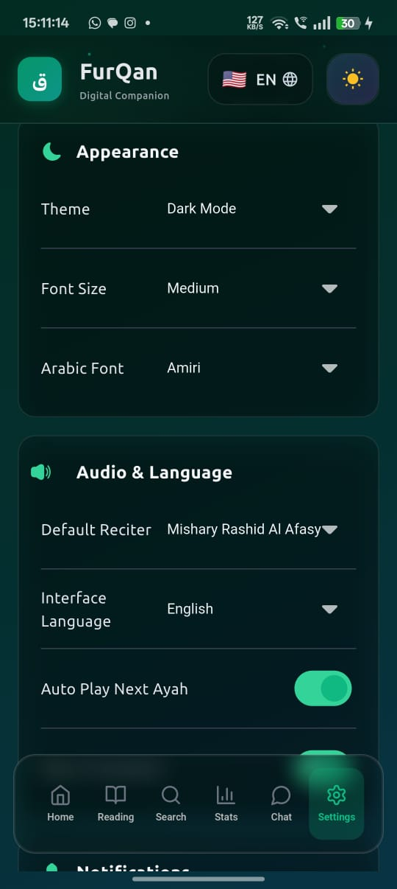 | 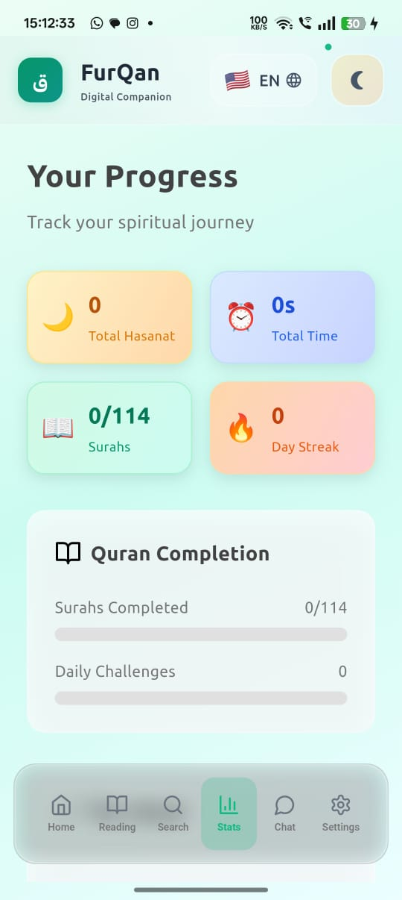 |
| **read** | **settings** | **stats** |
| 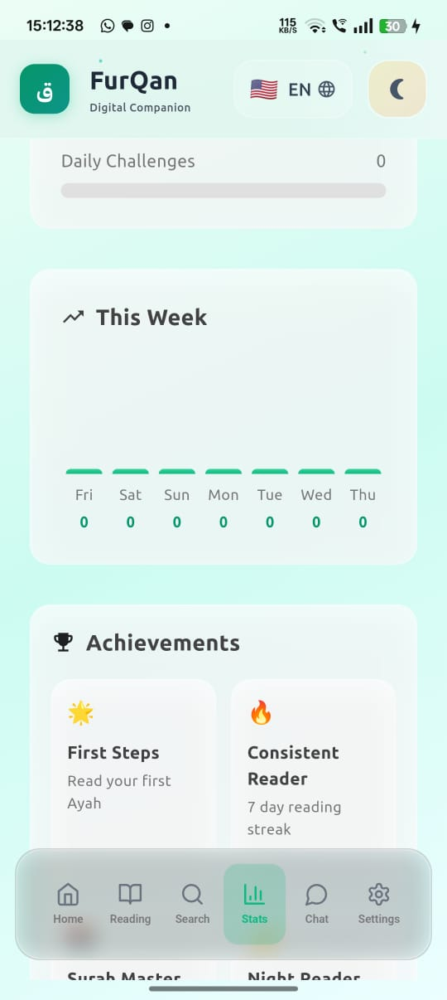 | 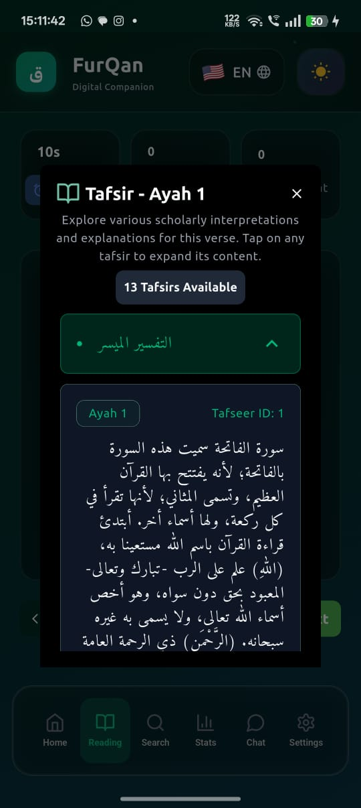 | 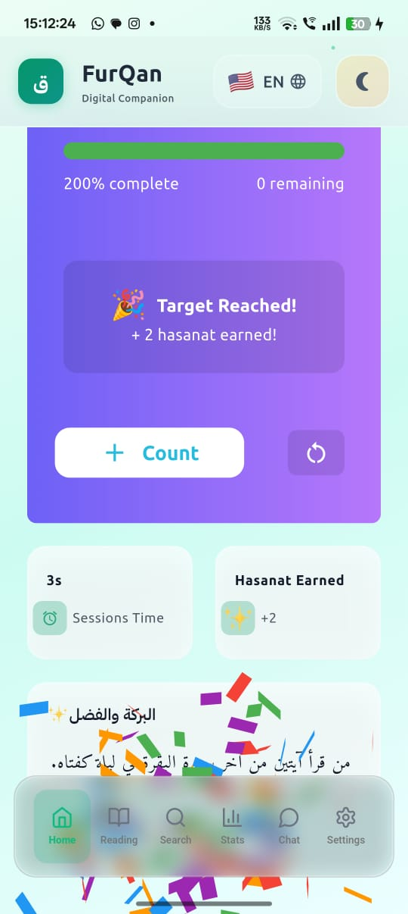 |
| **stats2** | **tafsir** | **zikr_counter** |
| 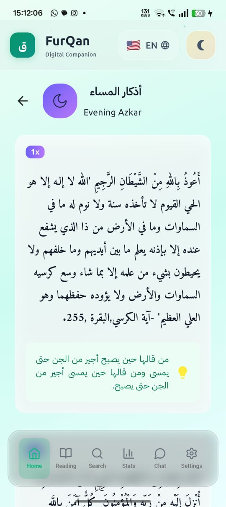 | | |
| **zikr_data** | | |

---

